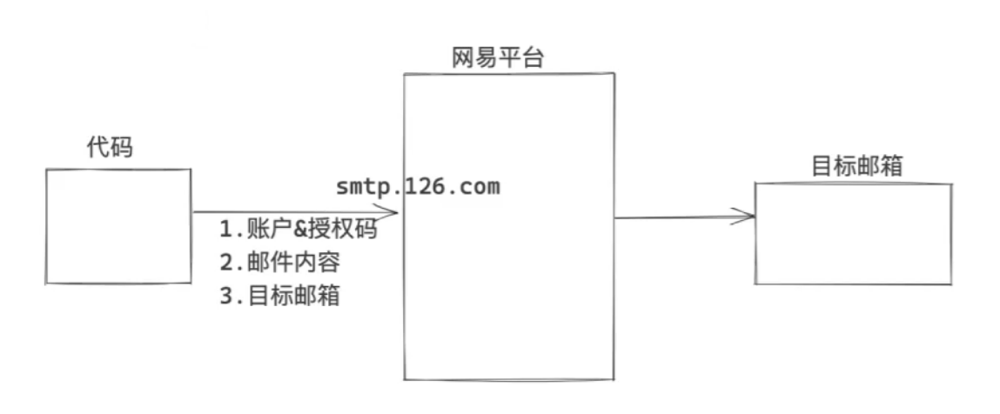
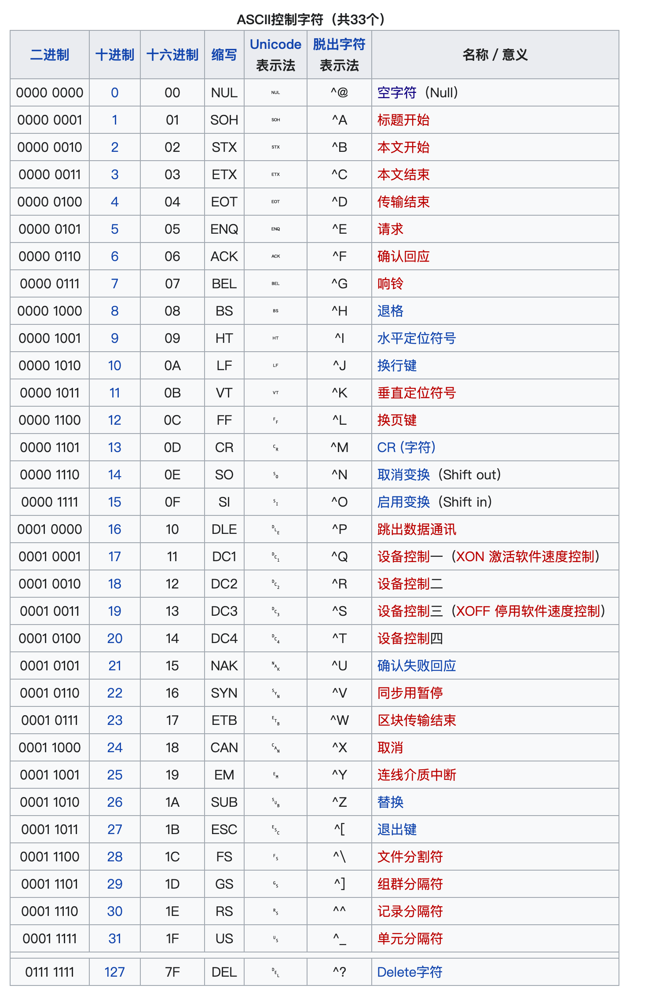

## 数据类型

>**1. 可变类型：列表、字典、集合**
>
>**2. 不可变类型：字符串、整型、元组、布尔类型**

### 布尔类型 bool

>False 假、True 真

```python
bool():
0、""、[]、()、{}、set()、None => False
其他 => True
```

**逻辑谓词：**

```python
and 与
or  或
not 非
in  属于
```

>**与：0与任何值结果为0，1与任何值结果为任何值**
>
>**或：1或任何值结果为1，0或任何值结果为任何值**

```python
v1 = 0 and 12       # v1 = 0
v2 = '1' and 99     # v2 = 99
v3 = '' or 18       # v3 = 18
v4 = 'hello' or ''  # v4 = 'hello'
```


### 整型 int

二进制 0b

```python
十进制 => 二进制字符串
bin()
```

八进制 0o

```python
十进制 => 八进制字符串
oct()
```

十六进制 0x

```python
十进制 => 十六进制字符串
hex()
```


### 浮点型 float

>浮点型，就是我们常说的小数
>
>注意：由于计算机底层浮点型的存储原理，有时候浮点型获取的值可能不会太精确

```python
# 精确的浮点数运算，可以使用 decimal模块
import decimal

v1 = decimal.Decimal('0.1')
v2 = decimal.Decimal('0.2')

v3 = v1 + v2
print(v3) # 0.3
```


### 字节类型 bytes

>**注意：UTF-8 中一个中文占3个字节，GBK 中一个中文占2个字节**

```python
字符串 => 字节 ：encode()
字节 => 字符串：decode()
```

```python
name = "酱油瓶"  # 字符串类型 str，底层采用 unicode 编码  
data1 = name.encode('utf-8')  # 字节类型 bytes，底层采用 utf-8 编码  
data2 = name.encode('gbk')  # 字节类型 bytes，底层采用 gbk 编码  
  
print(data1)  # b'\xe9\x85\xb1\xe6\xb2\xb9\xe7\x93\xb6'  
print(data2)  # b'\xbd\xb4\xd3\xcd\xc6\xbf'
```


### 字符串 str

>**注意：字符串是不可变的**

字符串编码

```python
unicode  # 字符串类型 str，底层采用 unicode 编码
utf-8    # 字节类型 bytes，底层采用 utf-8 编码
```

```python
独有功能：
	1. 大小写：upper()、lower()
	2. 是否为数字：isdecimal()
	3. 是否以特定字符串为开头或结尾：startswith()、endswith()
	4. 替换指定字符串：replace()
	5. 去除字符串左右的特定字符（默认为空格）：
		strip()   左右都去除
		lstrip()  去除左边特定字符
		rstrip()  去除右边特定字符
	6. 填充字符串到指定长度：
		center()  字符串居中
		ljust()   字符串居左，右填充
		rjust()   字符串居右，左填充
		zfill()   左填充0
	7. 格式化输出：
		''.join()    以特定字符连接字符串
		''.format()  {}是占位符
	8. 以特定字符为界切分字符串：split()
```

```python
公共功能：
	1. 长度：len()
	2. 索引：str[index]
	3. 切片：str[start:end+1:step]
	4. for循环遍历字符串中的每个字符
	5. in是否包含
```


### 列表 list

>列表，是一个**有序**且**可变**的容器，元素可以是多种不同的数据类型

```python
定义列表：
1. item = []
2. item = list()
```

```python
独有功能：
	1. 列表尾部添加元素：append()
	2. 特定索引前添加元素：insert()
	3. 删除第一个匹配到的元素：remove()
	4. 删除特定索引的元素（不写默认为尾部元素）：
		pop()
		关键字：del
	5. 清除列表元素：clear()
	6. 对列表元素进行排序：sort()
		默认从小到大
		若 reverse = True，则从大到小
```

```python
公共功能：
	1. 长度：len()
	2. 索引：list[index]
	3. 切片：list[start:end+1:step]
	4. for循环遍历列表中的每个元素
	5. 嵌套
	6. in是否包含
```

```python
data = []
v1 = data.append(123) # v1 = None，append()函数无返回值，硬要接收只会返回None
```

### 元组 tuple

>元组，是一个**有序**且**不可变**的容器，元素可以是多种不同的数据类型
>
>1. 元组的元素个数不能修改
>
>2. 元组的元素也不能被替换成其他的值
>
>**注意：元组中的列表可以进行增删改元素的操作，即该列表自身内部的修改**

```python
定义元组：
1. item = ()
2. item = tuple()
```

```python
独有功能：
	无
```

```python
公共功能：
	1. 长度：len()
	2. 索引：tuple[index]
	3. 切片：tuple[start:end+1:step]
	4. for循环遍历元组中的每个元素
	5. 嵌套
	6. in是否包含
```

>**注意：元组中只有1个元素时，该元素后要添加 ','**

```python
v1 = (1,)    # v1是元组
v2 = (1)     # v2 = 1
```


### 字典 dict

>字典是一个**无序**、**键不重复**且**元素只能是键值对**的**可变**的容器
>
>1. **Python3.6之前，字典无序的；Python3.6之后字典有序**
>
>2. **键重复时数据会被覆盖**
>
>3. **键必须是可哈希类型**
>
>	**可哈希：int、bool、str、tuple**
>	
>	**不可哈希：list、dict**

```python
定义字典：
1. item = {}
2. item = dict()
```

```python
独有功能：
	1. 根据键获取值：get()   # 键不存在时返回 None 或传入的默认值
	2. 获取所有的键：keys()  
	 # 结果是一个高仿列表，dict_keys([...])，支持for循环，可以直接使用list()将其转为列表
	3. 获取所有的值：values()
	 # 结果是一个高仿列表，dict_values([...])，支持for循环，可以直接使用list()将其转为列表
	4. 获取所有的键值：items()
	 # 结果是一个高仿列表，dict_items([()...()])，每个元素是一个元组，元组中封装键和值
	 # 支持for循环，for循环支持双变量
```

```python
公共功能：
	1. 长度：len()
	2. 索引：dict[key]
	 # 与列表、字符串、元组不同，字典的索引是键，而不是0,1,2...
	 # 键不存在会报错
	 # 支持通过索引增删改 del
	3. for循环遍历元组中的每个元素
	4. 嵌套
	5. in是否包含 # 判断键是否在字典中
```


### 集合 set

>集合是一个**无序**、**可变**、**元素必须可哈希**且**元素不重复**的容器
>
>应用情景：不希望数据重复时使用

```python
定义集合：item = set()
```

```python
独有功能：
	1. 添加元素：add()
	2. 删除元素：discard()   # 若元素不存在，不会报错
	3. 交集：
		   方法1：set1.intersection(set2)  # 生成新的集合
		   方法2：set1 & set2
	4. 并集：
		   方法1：set1.union(set2)
		   方法2：set1 | set2
	5. 差集：
		   方法1：set1.difference(set2)  # set1中有的，但set2中没有的元素
		   方法2：set1 - set2            # set1中有的，但set2中没有的元素
```

```python
公共功能：
	1. 长度：len()
	2. for循环遍历集合中的每个元素，但无序
	3. in是否包含
	  # 判断元素是否在集合中
	  # 集合中的元素可哈希，效率高，速度快
```

集合的存储：


**容器之间的转换**

>列表、元组、集合之间可以进行相互转换
>
>**原则：想转换成谁就用谁的英文名包裹起来：list()、tuple()、set()**
>
>**注意：列表 / 元组 => 集合，会自动去重**


### None类型

>**None 表示空值，相当于其他语言中的 null**


## 文件操作

>**操作对象：普通文本文件**
>
>**基本步骤：**
>
>	**1. 打开文件**
>	
>	**2. 操作文件**
>	
>	**3. 关闭文件**

### 写文件

#####  1. 覆盖写入

```python
# 1. 打开文件  
# hello.txt 文件路径  
# mode = 'wb' 以写模式打开文件：文件不存在，则创建文件；文件存在，则清空文件（覆盖写入）
	# w - 覆盖写入
	# b - 字节类型
file_object = open('hello.txt',mode = 'wb')  
  
# 2. 写入内容  
hello = 'hello world'  
file_object.write( hello.encode('utf-8') )  
  
# 3. 关闭文件  
file_object.close()
```

练习题：用户注册，每注册一个用户就在文件中写入一行"用户名,密码"（循环操作，Q/q终止）

```python
# 覆盖写入
file_object = open('user_info.txt',mode = 'wb')  
  
while True:  
    name = input('请输入用户名：')  
    if name.upper() == 'Q':  
        break  
    password = input('请输入密码：')  
  
    user_info = '{},{}\n'.format(name,password)  
  
    # 延时写入：暂时将数据写入计算机内存中（缓冲区），文件关闭后再一次性移动到硬盘（文件）中  
    file_object.write( user_info.encode('utf-8') )  
  
    # 实时写入：强制将内存（缓冲区）中的数据写入硬盘（文件）中  
    file_object.flush()  
  
file_object.close()
```

##### 2. 追加写入

```python
# 1. 打开文件  
# hello.txt 文件路径  
# mode = 'ab' 以写模式打开文件：文件不存在，则创建文件；文件存在，则在文件尾部追加写入
	# a - 追加写入
	# b - 字节类型
file_object = open('hello.txt',mode = 'wb')  
  
# 2. 写入内容  
hello = 'hello world'  
file_object.write( hello.encode('utf-8') )  
  
# 3. 关闭文件  
file_object.close()
```

**练习题：用户注册，每注册一个用户就在文件中写入一行"用户名,密码"（循环操作，Q/q终止）**

```python
# 追加写入
file_object = open('user_info.txt',mode = 'ab')  
  
while True:  
    name = input('请输入用户名：')  
    if name.upper() == 'Q':  
        break  
    password = input('请输入密码：')  
  
    user_info = '{},{}\n'.format(name,password)  
  
    # 暂时将数据写入计算机内存中（缓冲区），文件关闭后再一次性移动到硬盘（文件）中  
    file_object.write( user_info.encode('utf-8') )  
  
    # 实时写入：强制将内存（缓冲区）中的数据写入硬盘（文件）中  
    file_object.flush()  
  
file_object.close()
```


### 读文件

##### 1. 读取文件全部内容

```python
# 1. 打开文件  
# hello.txt 文件路径  
# mode = 'rb' 以读模式打开文件  
	# r - 读  
	# b - 字节类型  
file_object = open('hello.txt', mode = 'rb')  
  
# 2. 读取文件的所有内容  
content = file_object.read()  
print(content) # b'hello world' - 字节类型  

# 将字节类型解码为字符串类型
content_string = content.decode('utf-8')  
print(content_string) # hello world - 字符串类型  
  
# 3. 关闭文件  
file_object.close()
```

##### 2. 逐行读取

>读取大文件时，可以逐行读取

**方法1：使用 `readline()`**

```python
# 1. 打开文件  
# hello.txt 文件路径  
# mode = 'rb' 以读模式打开文件  
    # r - 读  
    # b - 字节类型  
file_object = open('hello.txt', mode = 'rb')  
  
# 2. 逐行读取文件内容  
# 读取文件第一行  
line1 = file_object.readline()  
print(line1.decode('utf-8').strip())  
# 读取文件第二行  
line2 = file_object.readline()  
print(line2.decode('utf-8').strip())  
# 读取文件第三行  
line3 = file_object.readline()  
print(line3.decode('utf-8').strip())  
# ... ...  
  
# 3. 关闭文件  
file_object.close()
```

**方法2：使用 `for` 循环**

```python
# 1. 打开文件  
# hello.txt 文件路径  
# mode = 'rb' 以读模式打开文件  
    # r - 读  
    # b - 字节类型  
file_object = open('hello.txt', mode = 'rb')  
  
# 2. 逐行读取文件内容  
for line in file_object:  
    line_string = line.decode('utf-8') # 将字节类型解码为字符串类型  
    line_string = line_string.strip()  # 去掉每行字符串前后的换行 \n    print(line_string)  
  
# 3. 关闭文件  
file_object.close()
```

**练习题1：读取文件每行中的单词**

```txt
q,quit,12,1  
w,wait,122,122  
e,equal,12,313  
  
  
s,seek,12222,2

```

```python
# 读模式打开文件
file_object = open('data.txt',mode = 'rb')  

# 逐行遍历
for line in file_object:  
    line_string = line.decode('utf-8').strip()  # 解码，并去除尾部换行符
    
    # '\n' => ''，若为空行，什么也不做；不为空行，输出本行中的单词
    if line_string:  
        word = line_string.split(',')[1]  
        print(word)  

# 关闭文件
file_object.close()
```

```txt
quit
wait
equal
seek
```

**练习题2：实现用户注册和用户登录功能**

```python
print('========== 用户注册 ==========')  
  
# 写文件  
register_file = open('user_data.txt', mode = 'ab')  
  
while True:  
    name = input('请输入姓名：')  
    if name.upper() == 'Q':  
        break  
    password = input('请输入密码：')  
  
    user_info = '{},{}\n'.format(name, password)  
    register_file.write(user_info.encode('utf-8'))  
  
# 关闭文件  
register_file.close()  
  
print('========== 用户登录 ==========')  
  
# 输入登录用户名和密码  
user_name = input('用户名：')  
user_password = input('密码：')  
  
output_text = '用户名或密码错误' # 输出信息  
  
# 读文件  
login_file = open('user_data.txt', mode = 'rb')  
  
# 逐行遍历  
for line in login_file:  
    # line = '用户名,密码\n'  
    line_string = line.decode('utf-8').strip()  # 解码，并去除尾部换行符  
    info = line_string.split(',')  
    if info[0] == user_name and info[1] == user_password:  
        output_text = '登录成功'  
  
print(output_text)  
  
# 关闭文件  
login_file.close()
```


### with上下文管理

>**注意：打开文件后一定要记得关闭文件，否则会造成资源浪费**
>
>**with上下文管理，让你告别忘记关闭文件：**
>
>	离开 `with` 的缩进后，会自动调用 `file_object.close()` 关闭文件 

```python
print('开始')  
  
# 离开缩进后，会自动调用file_object.close()关闭文件  
with open('hello.txt', mode = 'rb') as file_object:  
    data = file_object.read().decode('utf-8')  
    print(data)  
  
print('结束')
```


### 文件打开模式

- `wb`，写

```python
file_object = open('hello.txt',mode = 'wb')  

file_object.write( '你好'.encode('utf-8') )  

file_object.close()
```

- `w`，写

>**注意：需要设置 `encoding` 参数，会实现自动 `encode` 压缩编码**

```python
file_object = open('hello.txt',mode = 'w',encoding = 'utf-8')  

file_object.write( '你好' )  

file_object.close()
```

- `ab`，追加

```python
file_object = open('hello.txt',mode = 'ab')  

file_object.write( '你好'.encode('utf-8') )  

file_object.close()
```

- `a`，追加

>**注意：需要设置 `encoding` 参数，会实现自动 `encode` 压缩编码**

```python
file_object = open('hello.txt',mode = 'a',encoding = 'utf-8')  

file_object.write( '你好' )  

file_object.close()
```

- `rb`，读

```python
file_object = open('hello.txt',mode = 'rb')  

# 读取到的是被压缩成 utf-8 编码的字节类型数据
data = file_object.read()
# utf-8编码（字节类型） -> unicode编码（字符串类型）
data_string = data.decode('utf-8')
print(data_string)

file_object.close()
```

- `r`，读

>**注意：需要设置 `encoding` 参数，会实现自动 `decode` 解码**

```python
file_object = open('hello.txt',mode = 'r',encoding = 'utf-8')  

# 直接读取到的是 unicode 编码的原始字符串，不需要再 decode 解码
data = file_object.read()
print(data_string)

file_object.close()
```

**练习题2：实现用户注册和用户登录功能 —— 优化后**

```python
print('========== 用户注册 ==========')  
  
# 写文件  
register_file = open('user_data.txt', mode = 'a'，encoding = 'utf-8')  
  
while True:  
    name = input('请输入姓名：')  
    if name.upper() == 'Q':  
        break  
    password = input('请输入密码：')  
  
    user_info = '{},{}\n'.format(name, password)  
    register_file.write(user_info)  # 不需要再手动编码为 utf-8
  
# 关闭文件  
register_file.close()  
  
print('========== 用户登录 ==========')  
  
# 输入登录用户名和密码  
user_name = input('用户名：')  
user_password = input('密码：')  
  
output_text = '用户名或密码错误' # 输出信息  
  
# 读文件  
login_file = open('user_data.txt', mode = 'r'，encoding = 'utf-8')  
  
# 逐行遍历  
for line in login_file:  
    # line = '用户名,密码\n'  
    line_string = line.strip()  # 不需要再手动解码 utf-8 为 unicode  
    info = line_string.split(',')  
    if info[0] == user_name and info[1] == user_password:  
        output_text = '登录成功'  
  
print(output_text)  
  
# 关闭文件  
login_file.close()
```


## 函数

>**面向过程编码：按照业务逻辑从上到下去写代码**

**案例1：监控系统，用于监控机房电脑的各指标**

```python
print('欢迎使用xx监控系统')

if CPU占用率 > 90%:
	发送报警邮件 -> 10行代码

if 硬盘使用率 > 95%:
	发送报警邮件 -> 10行代码

if 内存使用率 > 98%:
	发送报警邮件 -> 10行代码
```

>**面向对象编码（函数式编程）：使用函数编写代码**
>
>**函数应用场景：**
>
>	**1. 反复用到重复代码时，可以选择用函数编程。【增强代码重用性】**
>	
>	**2. 业务逻辑代码太长时，可以选择用函数将代码拆分。【增强代码可读性】**

**案例1：监控系统，用于监控机房电脑的各指标**

```python
def 发送邮件():
	发送报警邮件 -> 10行代码

print('欢迎使用xx监控系统')

if CPU占用率 > 90%:
	发送邮件()

if 硬盘使用率 > 95%:
	发送邮件()

if 内存使用率 > 98%:
	发送邮件()
```

**案例2：Python代码发送邮件**

>邮箱： 17811276168@163.com
>
>授权码：NJ3RSZJZTrMaiPfV
>
>SMTP服务器: smtp.163.com



```python
# 1. 导入Python内置模块  
import smtplib  
from email.mime.text import MIMEText  
from email.utils import formatdate, formataddr  
  
# 2. 构建邮件内容  
msg = MIMEText('Hello QQ!','html','utf-8') # 邮件内容，格式，编码  
msg['From'] = formataddr(['Worst', '17811276168@163.com']) # 自己名字，自己邮箱  
msg['To'] = '2957636518@qq.com' # 目标邮箱  
msg['Subject'] = '163 to QQ' # 邮件主题  
  
# 3. 发送邮件  
server = smtplib.SMTP_SSL('smtp.163.com') # SMTP服务器
server.login('17811276168@163.com', 'NJ3RSZJZTrMaiPfV') # 自己邮箱，授权码  
server.sendmail('17811276168@163.com', '2957636518@qq.com', msg.as_string()) # 自己邮箱，收件人邮箱，邮件内容  
server.quit()
```

>定义发送邮件函数

```python
# 1. 导入Python内置模块  
import smtplib  
from email.mime.text import MIMEText  
from email.utils import formatdate, formataddr  
  
# 发送邮件函数  
def send_email(to_email):  
    # 2. 构建邮件内容  
    msg = MIMEText('Hello 染嘻嘻!', 'html', 'utf-8')  # 邮件内容，格式，编码  
    msg['From'] = formataddr(['Worst', '17811276168@163.com'])  # 自己名字，自己邮箱  
    msg['To'] = to_email  # 目标邮箱  
    msg['Subject'] = '163 to QQ'  # 邮件主题  
  
    # 3. 发送邮件  
    server = smtplib.SMTP_SSL('smtp.163.com')  # SMTP服务器  
    server.login('17811276168@163.com', 'NJ3RSZJZTrMaiPfV')  # 自己邮箱，授权码  
    server.sendmail('17811276168@163.com', to_email, msg.as_string())  # 自己邮箱，收件人邮箱，邮件内容  
    server.quit()  
  
# 4. 调用发送邮件函数  
send_email('2957636518@qq.com')
```


### 函数的参数

```python
def 函数名(形式参数1, 形式参数2): # 形式参数（形参）
	函数内部代码，将形式参数当作变量来使用

# 执行函数时，传入的值称为实际参数（实参）
函数名(实际参数1,实际参数2,实际参数3)
```

>**在执行函数时，传入参数一般有两种模式**
>
>	**1. 位置传参（与传参顺序相关）**
>	
>	**2. 关键字传参（与传参顺序无关）**
>
>**注意：如果要混合使用时，位置传参必须要在前面，关键字传参在后面**


>**注意事项：**
>
>	**1. 函数要求形参有几个，就要传入几个实参**
>	
>	**2. 实参可以是任意类型：None、bool、int、str、list、dict ... ...**

#### 练习题

1. 定义函数，接收字符串类型的参数，计算字符串中 'a' 出现的次数并输出

```python
def count_a(data_string):
    count = 0
    for char in data_string:
        if char == 'a':
            count += 1
    print(count)

text = input('请输入字符串：')
count_a(text)
```

2. 定义函数，接收字2个参数：`字符串-文本`、`字符串-关键字`，计算关键字在文本中的出现次数

```python
def count_chars(data_string, key):  
    count = 0  
    for char in data_string:  
        if char == key:  
            count += 1  
    print(count)  
  
text = input('请输入字符串：')  
chars = input('请输入待统计的字符：')  
count_chars(text, chars)
```

3. 定义函数，接收字1个参数：`列表`，输出所有以 'a' 为开头的元素构成的新列表

```python
def list_a_start(lst):  
    list_a = []  
    for item in lst:  
        if item.startswith('a'):  
            list_a.append(item)  
    print(list_a)  
  
test_lst = input('请输入字符串（以,间隔）：').split(',')  
list_a_start(test_lst)
```

#### 默认参数

>在定义函数时，也可以为某些参数设置默认值
>
>**注意：函数定义时设置的默认参数，只能放在最后**

定义函数，接收字2个参数：`字符串-文本`、`字符串-关键字`，计算关键字在文本中的出现次数

```python
def count_chars(data_string, key = 'a'):  # 设置默认参数'a'
    count = 0  
    for char in data_string:  
        if char == key:  
            count += 1  
    print(count)  
  
text = input('请输入字符串：')  
count_chars(text) # 使用默认参数，统计text中'a'的出现次数
```

#### 动态参数

> `*`：通过**位置传参**传入多个参数，传入的参数统一打包为**元组**

```python
def fuction(*a):
	print(a)

function()     # 元组 ()
function(1)     # 元组 (1,)
function([1222, 1110])     # 元组 ([1222, 1110],)
function((1222, 1110))     # 元组 ((1222, 1110),)
function(1, 22, 333)     # 元组 (1, 22, 333)
function('cat', 99, True)     # 元组 ('cat', 99, True)
function(12, 'dog', [1222, 1110])     # 元组 (12, 'dog', [1222, 1110])
```

> `**`：通过**关键字传参**传入多个参数，传入的参数统一打包为**字典**

```python
def fuction(**b):
	print(b)

function()     # 字典 {}
function(a = 1)     # 字典 {'a':1}
function(a = [1222, 1110])     # 字典 {'a':[1222, 1110]}
function(a = 1,b = 22,c = 333)     # 字典 {'a':1, 'b':22, 'c':333}
function(a = 'cat',b = 99,c = True)     # 字典 {'a':'cat', 'b':99, 'c':True}
function(a = 12,b = 'dog',c = [1222, 1110])     
# 字典 {'a':12, 'b':'dog', 'c':[1222, 1110]}
```

>**`*` 和 `**` 混合使用：**
>
>	**1. 定义函数时，`*` 在前， `**` 在后**
>	
>	**2. 传参时，位置传参在前，关键字传参在后**
>	
>	**3. 不传参数，分别为空元组 `()` 和空字典 `{}`**
>	
>	**4. 在定义动态参数时，一般使用 `*args` 和 `*kwargs` 作为形参名**


### 函数返回值

>**注意：**
>
>	**1. 返回值可以是任意类型**
>	
>	**2. 函数没有返回值 或 只写了 `return`，默认返回 `None` 空值**
>	
>	**3. 在函数执行过程中，一旦遇到 `return` ，立即结束当前函数的执行，并返回值**

```python
def func1():
	return 1 # 返回 整型 1
```

```python
def func2():
	return [1,2,3] # 返回 列表 [1,2,3]
```

```python
def func3():
	return (1,2,3) # 返回 元组 (1,2,3)
```

>**注意下面这种写法**

```python
def func4():
	return 1,2,3 # 返回 元组 (1,2,3)
```

```python
def func5():
	# 无返回值 默认返回 None
```

```python
def func5():
	return # 无返回值 默认返回 None
```

```python
def func6():
	print(1)
	return 2 # 函数终止
	print(3) # 该语句不执行
```

```python
def func7():
	for i in range(100):
		return i

res = func7() # res = 0
```

```python
def func7():
	for i in range(100):
		break

res = func7() # res = None
```

```python
def func7():
	for i in range(100):
		continue

res = func7() # res = None
```

```python
def func7():
	for i in range(100):
		print(i)

res = func7() # res = None
```

#### 练习题

1. 定义一个函数，通过位置传参传入多个整型参数，对传入的参数进行求和，并返回该和值

```python
def get_sum(*args):  
    res = 0  
    for item in args:  
        res += item  
    return res  
  
v1 = get_sum(1,22,333,4444)  
print(v1) # 4800
```

2. 看代码写结果

```python
def func():
	print('开始')
	for i in range(2):
		print(i)
	print('结束')

res = func()
print(res)
```

```txt
开始
0
1
结束
None
```

3. 看代码写结果

```python
def func():
	print('开始')
	for i in range(2):
		print(i)
		break
	if 2 == 2:
		return 999
	else:
		return 123
	print('结束')

res = func()
print(res)
```

```txt
开始
0
999
```

4. 定义一个函数，接收两个参数

	- 参数1：字符串类型，表示文件路径
	
	- 参数2：字符串类型，表示关键字
	
	- 函数功能：
	
		- 判断文件是否存在，若文件不存在，返回None
		
		- 若文件存在，逐行读取文件数据，若该行含有关键字，则加入列表，最后返回该列表

>**提示：判断文件路径是否存在**

```python
import os  
  
file_path = r'D:\project\Python Project\pylearn\day01\text.py'  
res = os.path.exists(file_path)  
print(res) # True/Fales
```

```python
import os  
  
def key_in_file(path, key):  
    # 文件不存在  
    if not os.path.exists(path):  
        return None  
    # 文件存在  
    data_list = []  
    # with 上下文管理，不需要手动关闭文件  
    with open(path, mode = 'r', encoding = 'utf-8') as file_object:  
        for line in file_object:  
            line = line.strip() # 去掉换行符  
            if key in line:  
                data_list.append(line)  
    return data_list  
  
res = key_in_file(r'D:\project\Python Project\pylearn\day01\demo.py', 'qq')  
print(res)
```


### 函数调用

>**注意：**
>
>	**1. 函数必须先定义，再调用**
>	
>	**2. 函数可以嵌套调用**

1. 看代码写结果

```python
def f1():
	print(123)
	return 1

def f2(arg):
	data = arg + 100
	return data

def f3(num):
	print(num)

v1 = f1()     # v1 = 1
v2 = f2(v1)   # v2 = 101
v3 = f3(v2)   # v3 = None

print(v1)
print(v2)
print(v3)
```

```txt
123
101
1
101
None
```

2. 看代码写结果

```python
def f1():
	print(1)
	print(2)

def f2():
	print(666)
	f1()
	print(999)

f2()
```

```txt
666
1
2
999
```

3. 看代码写结果

```python
def f1():
	print(1)
	print(2)

def f2():
	print(666)
	data = f1()
	print(data)
	print(999)

f2()
```

```txt
666
1
2
None
999
```


### 函数参数传递的是内存地址/引用

>**注意：**
> 
>	**1. 函数在传递参数时，默认不会重新创建一份数据，再赋值给函数中的参数，而是实参和形参同时指向同一块内存**
>	
>	**2. 注意参数传递的是可变/不可变类型；函数内部执行的操作，是重新生成数据，还是操作原数据**
>	
>	**3. 每次执行一个函数时，都会为此执行过程创建一块内存（调用栈）**

```python
v1 = '武沛齐'
v2 = v1
```


```python
def func(s1):
	s1.upper()

v1 = 'wupeiqi'
func(v1)

print(v1) # 字符串不可变，v1 = 'wupeiqi'
```

```python
def func(s1):
	s1.append(666)

v1 = [1,22,333]
func(v1)

print(v1) # 列表可变，v1 = [1,22,333,666]
```


### 函数作用域

>**注意：**
>
>	**1. 作用域，就是一块内存区域，只要在这个区域就可以共享这个区域的数据**
>	
>	**2. 在Python中，执行函数，就会为函数创建作用域**
>	
>	**3. Python代码只要一运行，就会有一个全局的作用域**
>	
>	==**4. 寻找变量时，优先会去自己的作用域中找，自己没有的话，再去父级作用域中找**==

```python
name = '武沛齐'  
age = 999  
  
if True:  
    email = 'xxx@live.com'  
else:  
    gender = '男'  
  
for i in range(10):  
    pass  
  
print(name) # 武沛齐  
print(age) # 999  
print(email) # xxx@live.com  
print(i) # 9

print(gender) # 报错

age = 100
print(age) # 100
```

```python
name = '武沛齐'  

def f1():
	age = 19
	print(age)

def f2():
	print(age)

f1() # 19
f2() # 报错

def f3():
	txt = '我是'
	data = txt + name
	print(data)

f3() # 我是武沛齐

def f4():
	txt = '我是'
	name = '李国良'
	data = txt + name
	print(data)

f4() # 我是李国良

print(name) # 武沛齐
```

#### 全局变量和局部变量

>**全局变量：在非函数中定义的变量（py文件顶层）**
>
>**局部变量：在函数中定义的变量**

==**注意：定义全局变量时，要使用大写字母，多个单词使用下划线连接**==

#### global关键字

>**`global` 关键字是在函数中，用于表示此变量不是新创建的数据，而是全局变量中的数据（地址指向相同）**

>**注意：**
>
>	==**1. 找变量时，优先会去自己的作用域中找，自己没有的话，再去父级作用域中找**==
>	
>	**2. 全局变量和局部变量重名时：**
>	
>		**<1> 无 `global` 关键字，自己内部创建的变量，与全局变量无关**
>		
>		**<2> 有 `global` 关键字，就是指全局变量**

1. 看代码写结果

```python
NAME = '武沛齐'

def func():
	NAME = '张点墨'
	print(NAME)

print(NAME)
func()
print(NAME)
```

```txt
武沛齐
张点墨
武沛齐
```

2. 看代码写结果

```python
NAME = '武沛齐'

def func():
	global NAME
	NAME = '张点墨'
	print(NAME)

print(NAME)
func()
print(NAME)
```

```txt
武沛齐
张点墨
张点墨
```

3. 看代码写结果

```python
NAME = 'root'

def func():
	global NAME
	NAME.upper()
	print(NAME)

print(NAME)
func()
print(NAME)
```

```txt
root
root
root
```

4. 看代码写结果

```python
DIGIT = [1,22,333]

def func():
	global DIGIT
	DIGIT = [4444,55555]
	print(DIGIT)

print(DIGIT)
func()
print(DIGIT)
```

```txt
[1,22,333]
[4444,55555]
[4444,55555]
```

5. 看代码写结果

```python
DIGIT = [1,22,333]

def func():
	global DIGIT
	DIGIT.append(4444)
	print(DIGIT)

print(DIGIT)
func()
print(DIGIT)
```

```txt
[1,22,333]
[1,22,333,4444]
[1,22,333,4444]
```

6. 看代码写结果

```python
DIGIT = [1,22,333]

def func():
	DIGIT.append(4444)
	print(DIGIT)

print(DIGIT)
func()
print(DIGIT)
```

```txt
[1,22,333]
[1,22,333,4444]
[1,22,333,4444]
```

7. 看代码写结果

```python
DIGIT = [1,22,333]

def func():
	DIGIT = [1,2,3]
	DIGIT.append(4444)
	print(DIGIT)

print(DIGIT)
func()
print(DIGIT)
```

```txt
[1,22,333]
[1,2,3,4444]
[1,22,333]
```


### 函数名就是变量名

```python
def func():
	print(123)

func = 1
print(func) # 1
```

```python
def func():  
    print(123)  

print(func) # <function func at 0x000001463CD5A2A0>

v1 = func()  
v2 = func
v3 = v2()

print(v1) # None
print(v2) # 函数 <function func at 0x000001463CD5A2A0>
print(v3) # None
```

```python
def func():  
	return 123  

data_list = [1,22,func,func()]

data_list[2] # 函数 <function func at 0x000001C3163CA2A0>
data_list[3] # 123

v1 = data_list[2]() # v1 = 123
```

```python
def f1():  
	return 123  

def f2():  
	return 234  

func_dict = {
	'1':f1,
	'2':f2
}

# 获取函数并执行
# func_dict['1']() - f1()
# func_dict['2']() - f2()
func_object = func_dict.get('1')
if func_object == None:
	print('函数不存在')
else:
	func_object()
```

>**注意：一个函数的函数名可以作为另一个函数的参数**

```python
def do():
	print('do')

def func(a1,a2):
	print(a1)
	a2()

func(11,do)
```

```txt
11
do
```

```python
def do():
	print('do')

def func(a1,a2):
	print(a1)
	res = a2()
	print(res)
	return 123

v1 = func(11,do)
print(v1)
```

```txt
11
do
None
123
```

#### 练习题1：用户管理系统

>普通版

```python
def register():
	pass

def login():
	pass

def show_users():
	pass

print('欢迎进入用户管理系统')
print('1.注册；2.登录；3.查看所有用户')

choice = input('请输入功能序号：')
choice = int(choice)

if choice == 1:
	register()
elif choice == 2:
	login()
else:
	show_users()
```

>**vip版：函数名作为变量名放入列表中，基于索引实现函数的调用**

```python
def register():
	pass

def login():
	pass

def show_users():
	pass

print('欢迎进入用户管理系统')
print('1.注册；2.登录；3.查看所有用户')

choice = input('请输入功能序号：')
choice = int(choice)

func_list = [register,login,show_users]
# func_list[0]() - 注册
# func_list[1]() - 登录
# func_list[2]() - 查看所有用户
func_list[choice - 1]()
```

>**vvip版：函数名作为变量名放入字典中，基于索引或 `get()` 方法实现函数的调用**

```python
def register():
	pass

def login():
	pass

def show_users():
	pass

print('欢迎进入用户管理系统')
print('1.注册；2.登录；3.查看所有用户')

choice = input('请输入功能序号：')

func_dict = {
	'1':register,
	'2':login,
	'3':show_users
}
# func_dict[choice]()
data = func_dict.get(choice) # data = None / 函数名
if not data: # data = None
	print('输入序号不存在')
else: # data = 函数名
	data()
```
 
#### 练习题2：资源下载管理器

系统有两大专区：图片专区、短视频专区

- 每个专区定义一个函数

- 用户选择

	- 选择对了进入专区
	
	- 选择错了重新选择（错误提示）
	
	- 用户键入Q/q终止程序

- 图片专区（短视频专区功能相同）

	- 罗列所有序号和图片
	
	- 让用户选择序号，用户选择那个序号
	
		- 输出用户的选择：标题 + URL
		
		- 下载该序号对应的图片
	
	- 再次提示用户是否继续，用户键入N/n返回上一级（让用户重新选择专区）

```python
# 图片
image_dict = {  
    '1':('王者荣耀图标','https://tse3-mm.cn.bing.net/th/id/OIP-C.Me-HzHoLbPeyOneew4qQUAAAAA')  
}
```

```python
# 短视频
video_dict = {  
    '1':{  
        'title':'OC-Welcome to our world!',  
        'url':'https://v.douyin.com/JqQUvLNFx9E/'  
    },  
    '2':{  
        'title':'漫士-理解极限和连续',  
        'url':'https://v.douyin.com/ycFvopivbN8/'  
    },  
    '3':{  
        'title':'万物解码ZO-保险的秘密',  
        'url':'https://v.douyin.com/EU7aL_soE8M/'  
    },  
    '4':{  
        'title':'epcdiy-熊猫烧香',  
        'url':'https://v.douyin.com/P7UWC4mPU3A/'  
    }  
}
```

##### 实现除下载以外的功能

```python
def get_image():  
    """ 图片专区 """
    print('==========图片专区==========')  
    image_dict = {  
        '1': ('王者荣耀图标', 'https://tse3-mm.cn.bing.net/th/id/OIP-C.Me-HzHoLbPeyOneew4qQUAAAAA')  
    }  
    msg_list = []  
    for key,value in image_dict.items():  
        msg = '{}.{}'.format(key, value[0])  
        msg_list.append(msg)  
    msg_string = '; '.join(msg_list)  
    print(msg_string)  
  
    while True:  
        choice_image = input('请输选择图片的序号 (n/N): ')  
        if choice_image.upper() == 'N':  
            return  
        item_tuple = image_dict.get(choice_image)  
        if not item_tuple:  
            print('\n序号选择错误，请重新输入')  
            continue  
        title,url = item_tuple  
        print(title, url)  
  
  
def get_video():  
    """ 短视频专区 """
    print('==========短视频专区==========')  
    video_dict = {  
        '1': {  
            'title': 'OC-Welcome to our world!',  
            'url': 'https://v.douyin.com/JqQUvLNFx9E/'  
        },  
        '2': {  
            'title': '漫士-理解极限和连续',  
            'url': 'https://v.douyin.com/ycFvopivbN8/'  
        },  
        '3': {  
            'title': '万物解码ZO-保险的秘密',  
            'url': 'https://v.douyin.com/EU7aL_soE8M/'  
        },  
        '4': {  
            'title': 'epcdiy-熊猫烧香',  
            'url': 'https://v.douyin.com/P7UWC4mPU3A/'  
        }  
    }  
    msg_list = []  
    for key,value in video_dict.items():  
        msg = '{}.{}'.format(key, value['title'])  
        msg_list.append(msg)  
    msg_string = '; '.join(msg_list)  
    print(msg_string)  
  
    while True:  
        choice_video = input('请输选择短视频的序号 (n/N): ')  
        if choice_video.upper() == 'N':  
            return  
        item_dict = video_dict.get(choice_video)  
        if not item_dict:  
            print('\n序号选择错误，请重新输入')  
            continue  
        title,url = item_dict['title'], item_dict['url']  
        print(title, url)  
  
  
def run():  
    """ 实现程序中的主要逻辑 """  
    func_dict = {  
        '1':get_image,  
        '2':get_video  
    }  
  
    while True:  
        print('----------专区选择----------')  
        print('1.图片专区; 2.短视频专区')  
        choice = input('请输入专区序号 (q/Q): ')  
        if choice.upper() == 'Q':  
            return  
  
        func = func_dict.get(choice)  
        if not func:  
            print('\n序号选择错误，请重新输入')  
            continue  
        # 用户选择正确，执行相应函数  
        func()  
  
run()
```

##### 实现下载功能

1. 安装第三方模块 `requests`

```shell
pip install requests
```

2. 基于第三方的模块实现下载

```python
import requests  
  
# 1.从网络上下载图片  
res = requests.get(  
    url = 'https://tse3-mm.cn.bing.net/th/id/OIP-C.Me-HzHoLbPeyOneew4qQUAAAAA',  
    headers = {  
        'User-Agent': 'Mozilla/5.0 (Windows NT 10.0; Win64; x64) AppleWebKit/537.36 (KHTML, like Gecko) Chrome/89.0.4389.90 Safari/537.36'  
    }  
)  
  
# 2.保存到本地  
file_object = open('王者荣耀.png', mode = 'wb')  
file_object.write(res.content)  # 字节类型 res.content = b'\xff\xd8\xff\xe0\x00\x10JFIF\x00\x01\x01\x01\x00...'
file_object.close()
```

##### 完整代码实现

```python
import requests  
  
def download(file_name, url):  
    """  
    实现下载图片、视频  
    :param file_name: 文件名  
    :param url: 文件链接  
    :return:  
    """    # 下载  
    res = requests.get(  
        url = url,  
        headers = {  
            'User-Agent': 'Mozilla/5.0 (Windows NT 10.0; Win64; x64) AppleWebKit/537.36 (KHTML, like Gecko) Chrome/89.0.4389.90 Safari/537.36'  
        }  
    )  
  
    # 保存  
    with open(file_name, mode = 'wb') as file_object:  
        file_object.write(res.content)  
  
def get_image():  
    """ 图片专区 """
    print('==========图片专区==========')  
    image_dict = {  
        '1': ('王者荣耀图标', 'https://tse3-mm.cn.bing.net/th/id/OIP-C.Me-HzHoLbPeyOneew4qQUAAAAA')  
    }  
    msg_list = []  
    for key,value in image_dict.items():  
        msg = '{}.{}'.format(key, value[0])  
        msg_list.append(msg)  
    msg_string = '; '.join(msg_list)  
    print(msg_string)  
  
    while True:  
        choice_image = input('请输选择图片的序号 (n/N): ')  
        if choice_image.upper() == 'N':  
            return  
        item_tuple = image_dict.get(choice_image)  
        if not item_tuple:  
            print('\n序号选择错误，请重新输入')  
            continue  
        title, url = item_tuple  
        file_name = '{}.png'.format(title)  
        download(file_name, url)  
  
def get_video():  
    """ 短视频专区 """
    print('==========短视频专区==========')  
    video_dict = {  
        '1': {  
            'title': 'OC-Welcome to our world!',  
            'url': 'https://v.douyin.com/JqQUvLNFx9E/'  
        },  
        '2': {  
            'title': '漫士-理解极限和连续',  
            'url': 'https://v.douyin.com/ycFvopivbN8/'  
        },  
        '3': {  
            'title': '万物解码ZO-保险的秘密',  
            'url': 'https://v.douyin.com/EU7aL_soE8M/'  
        },  
        '4': {  
            'title': 'epcdiy-熊猫烧香',  
            'url': 'https://v.douyin.com/P7UWC4mPU3A/'  
        }  
    }  
    msg_list = []  
    for key,value in video_dict.items():  
        msg = '{}.{}'.format(key, value['title'])  
        msg_list.append(msg)  
    msg_string = '; '.join(msg_list)  
    print(msg_string)  
  
    while True:  
        choice_video = input('请输选择短视频的序号 (n/N): ')  
        if choice_video.upper() == 'N':  
            return  
        item_dict = video_dict.get(choice_video)  
        if not item_dict:  
            print('\n序号选择错误，请重新输入')  
            continue  
        title, url = item_dict.values()  
        file_name = '{}.mp4'.format(title)  
        download(file_name, url)      
  
def run():  
    """ 实现程序中的主要逻辑 """  
    func_dict = {  
        '1':get_image,  
        '2':get_video  
    }  
  
    while True:  
        print('----------专区选择----------')  
        print('1.图片专区; 2.短视频专区')  
        choice = input('请输入专区序号 (q/Q): ')  
        if choice.upper() == 'Q':  
            return  
  
        func = func_dict.get(choice)  
        if not func:  
            print('\n序号选择错误，请重新输入')  
            continue  
        # 用户选择正确，执行相应函数  
        func()  
  
run()
```

### lambda表达式（匿名函数）

>**`lambda` 表达式（匿名函数），即一行代码实现定义简单的函数，在特定情况下，使代码更简洁**

```python
def f1():  
    return 123  
  
# [lambda 形参 : 函数体]  
f1 = lambda : 123 # 函数体中写了123，内部自动会执行一个return  
res = f1() # res = 123
```

```python
def f2(a1,a2):  
    return a1 + a2  
  
# [lambda 形参 : 函数体]  
f2 = lambda a1,a2 : a1 + a2 # 函数体中写了a1 + a2，内部自动会执行一个return a1 + a2  
res = f2(1,2) # res = 3
```

```python
def f3(daata_string):  
    return daata_string.upper()  

# [lambda 形参 : 函数体]
f3 = lambda daata_string : daata_string.upper() # 函数体中写了daata_string.upper()，内部自动会执行一个return daata_string.upper()
res = f3("root") # res = ROOT
```

```python
def f4(data_list):  
    return data_list[0]  
  
# [lambda 形参 : 函数体]  
f4 = lambda data_list : data_list[0] # 函数体中写了data_list[0]，内部自动会执行一个return data_list[0]  
res = f4([1,2,3]) # res = 1
```

看代码写结果

```python
def func(data_list):
	return data_list.append(123)

res = func([1,2,3]) # res = None
```

```python
func = lambda data_list : data_list.append(123)
res = func([1,2,3]) # res = None
```

#### 练习题

```python
f1 = lambda data : data.replace('中国','安徽')

res = f1('中国人') # res = '安徽人'
```

```python
f2 = lambda v1,v2 : v1.insert(0,v2)

res = f2([11,22],99) # res = None
```

```python
f3 = lambda name : name.split['-'][1]

res = f3('day01-python基础入门-第一篇-数据类型') # res = 'python基础入门'
```


### 内置函数

>Python内部为用户写好的函数，用户可以直接拿来使用，不需要自己再编写

#### 1. 数值计算（5个）

1. `abs()` ：计算绝对值

```python
res = abs(-1) # res = |-1| = 1
```

2. `pow()` ：计算次方

```python
res = pow(2,5) # res = 2^5 = 32
```

3. `sum()` ：求和

```python
res = sum( [1,2,3,4] ) # res = 1+2+3+4 = 10
```

4. `divmod()` ：求商和余数

```python
res1,res2 = divmod(5,2) # res1 = 5 // 2 = 2; res2 = 5 % 2 = 1
```

5. `round()` ：保留小数点后几位（**支持四舍五入**）

```python
res = round(3.1415926, 4) # res = 3.1416
```

#### 2. 最值、布尔值（4个）

1. `min()` ：获取最小值

```python
res = min( [1,2,3] ) # res = 1
```

2. `max()` ：获取最大值

```python
res = max( [1,2,3] ) # res = 3
```

3. `all()` ：是否所有元素转换成布尔值都是 `True`

>全为 `True` => `True`
>
>有一个为 `False` => `False`

```python
res1 = all( [1,2,3] ) # res1 = True

res2 = all( [0,1,2] ) # res2 = False

res3 = all( [1,2,''] ) # res3 = False
```

```python
name = input('请输入用户名：')
password = input('请输入密码：')

is_valid = all( [name,password] )
if is_valid:
	print('用户名和密码都不为空')
else:
	print('用户名或密码为空')
```

4. `any()` ：是否存在元素转换成布尔值为 `True`

>全为 `False` => `False`
>
>有一个为 `True` => `True`

```python
res1 = all( [1,2,3] ) # res1 = True

res2 = all( [0,1,2] ) # res2 = True

res3 = all( [0,''] ) # res3 = False
```

#### 3. 进制转换（4个）

>**注意：返回值都是字符串类型**

1. `bin()` ：十进制 => 二进制

```python
res = bin(2) # res = '0b10'
```

2. `oct()` ：十进制 => 八进制

```python
res = oct(8) # res = '0o10'
```

3. `hex()` ：十进制 => 十六进制

```python
res = hex(16) # res = '0x10'
```

4. `int()` ：其他进制 => 十进制

```python
res = int('10', base = 2) # res = 2
res = int('10', base = 8) # res = 8
res = int('10', base = 16) # res = 16
```

##### 练习题：IP地址转换

将点分十进制形式的IP地址 `ip = '192.168.11.223'` 转换为易于计算机处理的二进制形式

>程序流程：
>
>	1. 先将每组十进制数转换为二进制
>	
>	2. 去除 `0b` ，并补0补足8位
>	
>	3. 将每组二进制数拼接起来，得到整体二进制数
>	
>	4. 将整体二进制数转换为十进制数

```python
ip = '192.168.11.223'  
  
str_list = ip.split('.') # 1.分组  
  
bin_str_list = []  
  
for item in str_list:  
    bin_str = bin(int(item))[2:] # 2.转二进制，并去除前缀 0b    bin_fill_str = bin_str.zfill(8) # 补足到8位，不足的补0  
    bin_str_list.append(bin_fill_str)  
  
num_string = ''.join(bin_str_list) # 3.拼接成一串二进制字符串  
num = int(num_string) # 4.将二进制字符串转为十进制  
print(num)
```


>`lambda` 表达式

```python
ip = '192.168.11.223'
func = lambda ip : int(''.join(bin(int(i))[2:].zfill(8) for i in ip.split('.')),base = 2)  
print(func(ip))
```

#### 4. Unicode 字符、十进制转换（2个）

>**采用 `unicode` 编码，字符与二进制一一对应**

```txt
字 符             对应二进制              二进制对应的十进制
 武            110101101100110              27494
 a               1100001                     97
```

1. `ord()` ：字符 => 十进制

```python
res = ord('武') # 27494
```

2. `chr()` ：十进制 => 字符

```python
res = chr(27494) # 武
```

##### 练习题：生成4位随机字母验证码

>**注意：`unicode` 兼容 `ASCII` 码**

```python
import random

char_list = []
for i in range(4):
	num = random.randint(65,90) # 65 - A; 90 - Z
	char = chr(num) # 十进制 => 字符
	char_list.append(char)

res = ''.join(char_list)
print(res)
```




#### 5. 数据类型相互转换（9个）

1. `int()` ：常用 字符串 => 十进制

```python
res = int('1') # res = 1
```

2. `str()` ：常用 十进制 => 字符串

```python
res = str(27) # res = '27'
```

3. `bool()` ：其他数据类型 => 布尔值

4. `list()` ：常用 元组 / 集合 => 列表

5. `tuple()` ：常用 列表 / 集合 => 元组

6. `set()` ：常用 元组 / 列表 => 集合

>**注意：元组 / 列表 => 集合时，会自动去重**

7. `dict()` ：其他数据类型 => 字典

8. `float()` ：整型 => 浮点型

9. `bytes()` ：字符串 => 字节类型

#### 6. 数据类型相互转换（9个）

1. `len()` ：求（字符串、列表、元组、集合、字典）长度

```python
res = len('i love python') # res = 13
```

2. `print()` ：打印

```python
print('i love python')
```

3. `input()` ：输入

```python
reasson = input('why do you love python?')
```

3. `open()` ：打开文件

```python
with open(r'D:\Python_Project\test.txt', mode = 'w', encoding = 'utf-8') as file_object:
	file_object.write('i love python')
```

3. `range()` ：一般配合 `for` 循环使用

```python
for i in range(2):
	print(i)
```

```txt
0
1
```

3. `hash()` ：计算哈希值

>**注意：**
>
>	**1. 字典的键、集合的元素都必须是可哈希的**
>	
>	**2. 列表、字典不可哈希**


```python
res = hash('酱油瓶') # res = 856608655605105022
```


```txt
Traceback (most recent call last):
  File "D:\Project\Python Project\pylearn\day01\text.py", line 1, in <module>
    res = hash([1,2,3])
          ^^^^^^^^^^^^^
TypeError: unhashable type: 'list'
```

### 推导式


