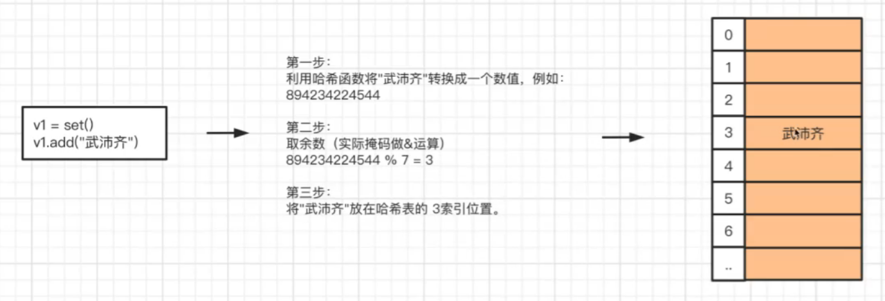

# 数据类型

### 布尔值 bool

>False 假、True 真

```python
bool():
字符串 => 布尔：
	1. 空字符串 => False
	2. 非空字符串 => True
整型 => 布尔
	3. 0 => False
	4. 非0 => True
```

**逻辑谓词：**

```python
and 与
or  或
not 非
in  属于
```

>**与：0与任何值结果为0，1与任何值结果为任何值**
>
>**或：1或任何值结果为1，0或任何值结果为任何值**

```python
v1 = 0 and 12       # v1 = 0
v2 = '1' and 99     # v2 = 99
v3 = '' or 18       # v3 = 18
v4 = 'hello' or ''  # v4 = 'hello'
```


### 整型 int

二进制 0b

```python
十进制 => 二进制字符串
bin()
```

八进制 0o

```python
十进制 => 八进制字符串
oct()
```

十六进制 0x

```python
十进制 => 十六进制字符串
hex()
```


### 浮点型 float


### None


### 字节类型


### 字符串 str

>**注意：字符串是不可变的**

字符串编码
```python
ASCII
unicode
UTF-8
```

```python
独有功能：
	1. 大小写：upper()、lower()
	2. 是否为数字：isdecimal()
	3. 是否以特定字符串为开头或结尾：startswith()、endswith()
	4. 替换指定字符串：replace()
	5. 去除字符串左右的特定字符（默认为空格）：
		strip()   左右都去除
		lstrip()  去除左边特定字符
		rstrip()  去除右边特定字符
	6. 填充字符串到指定长度：
		center()  字符串居中
		ljust()   字符串居左，右填充
		rjust()   字符串居右，左填充
		zfill()   左填充0
	7. 格式化输出：
		''.join()    以特定字符连接字符串
		''.format()  {}是占位符
	8. 以特定字符为界切分字符串：split()
```

```python
公共功能：
	1. 长度：len()
	2. 索引：str[index]
	3. 切片：str[start:end+1:step]
	4. for循环遍历字符串中的每个字符
	5. in是否包含
```


### 列表 list

>列表，是一个**有序**且**可变**的容器，元素可以是多种不同的数据类型

```python
定义列表：
1. item = []
2. item = list()
```

```python
独有功能：
	1. 列表尾部添加元素：append()
	2. 特定索引前添加元素：insert()
	3. 删除第一个匹配到的元素：remove()
	4. 删除特定索引的元素（不写默认为尾部元素）：
		pop()
		关键字：del
	5. 清除列表元素：clear()
	6. 对列表元素进行排序：sort()
		默认从小到大
		若 reverse = True，则从大到小
```

```python
公共功能：
	1. 长度：len()
	2. 索引：list[index]
	3. 切片：list[start:end+1:step]
	4. for循环遍历列表中的每个元素
	5. 嵌套
	6. in是否包含
```


### 元组 tuple

>元组，是一个**有序**且**不可变**的容器，元素可以是多种不同的数据类型
>
>1. 元组的元素个数不能修改
>
>2. 元组的元素也不能被替换成其他的值
>
>**注意：元组中的列表可以进行增删改元素的操作，即该列表自身内部的修改**

```python
定义元组：
1. item = ()
2. item = tuple()
```

```python
独有功能：
	无
```

```python
公共功能：
	1. 长度：len()
	2. 索引：tuple[index]
	3. 切片：tuple[start:end+1:step]
	4. for循环遍历元组中的每个元素
	5. 嵌套
	6. in是否包含
```

>**注意：元组中只有1个元素时，该元素后要添加 ','**

```python
v1 = (1,)    # v1是元组
v2 = (1)     # v2 = 1
```


### 字典 dict

>字典是一个**无序**、**键不重复**且**元素只能是键值对**的**可变**的容器
>
>1. **Python3.6之前，字典无序的；Python3.6之后字典有序**
>
>2. **键重复时数据会被覆盖**
>
>3. **键必须是可哈希类型**
>
>	可哈希：int、bool、str、tuple
>	
>	不可哈希：list、dict

```python
定义字典：
1. item = {}
2. item = dict()
```

```python
独有功能：
	1. 根据键获取值：get()   # 键不存在时返回 None 或传入的默认值
	2. 获取所有的键：keys()  
	 # 结果是一个高仿列表，dict_keys([...])，支持for循环，可以直接使用list()将其转为列表
	3. 获取所有的值：values()
	 # 结果是一个高仿列表，dict_values([...])，支持for循环，可以直接使用list()将其转为列表
	4. 获取所有的键值：items()
	 # 结果是一个高仿列表，dict_items([()...()])，每个元素是一个元组，元组中封装键和值
	 # 支持for循环，for循环支持双变量
```

```python
公共功能：
	1. 长度：len()
	2. 索引：dict[key]
	 # 与列表、字符串、元组不同，字典的索引是键，而不是0,1,2...
	 # 键不存在会报错
	 # 支持通过索引增删改 del
	3. for循环遍历元组中的每个元素
	4. 嵌套
	5. in是否包含 # 判断键是否在字典中
```


### 集合 set

>集合是一个**无序**、**可变**、**元素必须可哈希**且**元素不重复**的容器
>
>应用情景：不希望数据重复时使用

```python
定义集合：
1. item = set()
```

```python
独有功能：
	1. 添加元素：add()
	2. 删除元素：discard()   # 若元素不存在，不会报错
	3. 交集：
		   方法1：set1.intersection(set2)  # 生成新的集合
		   方法2：set1 & set2
	4. 并集：
		   方法1：set1.union(set2)
		   方法2：set1 | set2
	5. 差集：
		   方法1：set1.difference(set2)  # set1中有的，但set2中没有的元素
		   方法2：set1 - set2            # set1中有的，但set2中没有的元素
```

```python
公共功能：
	1. 长度：len()
	2. for循环遍历集合中的每个元素，但无序
	3. in是否包含
	  # 判断元素是否在集合中
	  # 集合中的元素可哈希，效率高，速度快
```

集合的存储：



**容器之间的转换**

>列表、元组、集合之间可以进行相互转换
>
>**原则：想转换成谁就用谁的英文名包裹起来：list()、tuple()、set()**
>
>**注意：列表 / 元组 => 集合，会自动去重**


